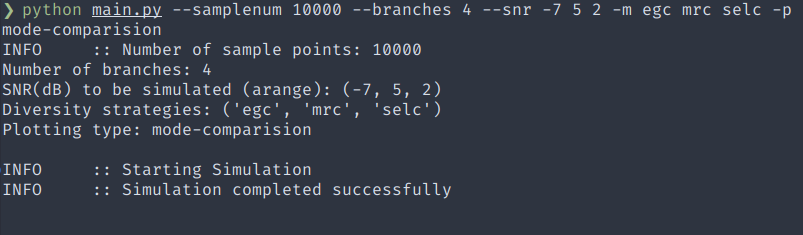
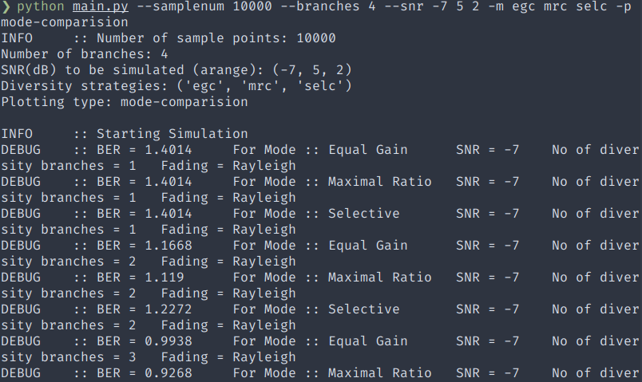

# Receiver Diversity Combining Simulation

Simulation of various diversity combining strategies at receiver side, namely:
- Selective Combining
- Equal Gain Combining
- Maximal Ratio Combining

The simulation is done for *Rayleigh* and *Rician* fading channels, assuming constant trasmission power and QPSK modulation.

## Introduction

### Rayleigh and Rician fading

In wireless communications, each wave interaction with the objects in the propagation environment results in a large number of sent signal replicas with different attenuation, phase shift, and delay arriving to the receiver input. The superposition of these replicas at the receive side, and the mobility of transmitters and/or receivers, cause time- variability of the received signal amplitude, i.e. at the receive side signal there are amplification or signal attenuation. This phenomenon is referred to, in the literature, as fading.

 Rayleigh, Rice, Nakagami-m, Nakagami-q and Weibull distribution are commonly used for modeling signal propagation in environments with multiple signal paths, which depend greatly on fading phenomenon. The application of specific model is conditioned by the specific propagation environment. 
 - Rayleigh channel model is used in situations where there is no direct line-of-sight (LOS) between the transmitter and the receiver. This is typical for urban environments.
 - Rice model is used in the inter-city areas and suburban areas, where LOS exists.

### Diversity Combining

In order to improve the system performance in the case of significant fading different methods are used, but diversity combining techniques are most frequently applied.
Diversity combining is the technique applied to combine the multiple received signals of a diversity reception device into a single improved signal. The most commonly used techniques of combining signals after application of diversity techniques are:
- Selection Combining *(choice of branch with the best signal-to-noise ratio)*
- Maximum Ratio Combining *(combining with a maximum signal-to-noise ratio)*
- Equal Gain Combining *(combining with the equal contribution of all branches)*

## Combining techniques

### Selection Combining (SC)
SC is the simplest and most commonly used method for combining signals in Diversity system, which is based on choosing the branch with the most favourable SNR. SC receiver estimates the current value of SNR in all branches and selects the one with the most favourable SNR.

### Maximal Ratio Combining (MRC)
MRC is the optimal linear technique of signal combination in the Diversity system, which provides the best statistical results in limiting the impact of fading. The signal in each of Diversity branches is, before summarizing, multiplied by the matching weighting factor, thus equating phases of all signals, and the branches with more favorable SNR are taken with greater contribution. 

This ensures that the signal with more power has greater contribution in the received sum of signals. Therefore, it is necessary to have measurement of SNR in all branches, and that is why this technique is expensive for practical implementation 

### Equal Gain Combining (EGC)
When applying EGC technique of combining signals, phase-changes of signals in all diversity branches are compensated, and then signals are summed. Unlike the MRC technique, all summands have the same weighting factor, so it is not required to measure and estimate SNR in all diversity branches. That’s why this technique is simpler and cheaper for practical implementation.

 Slightly worse performances comparing to MRC techniques implementation are the tradeoffs of simpler and cheaper practical implementation

### Direct Combining* (DC)

DC is basically just summing up all the signals from diversity branches without any phase-change compensation. This generally leads to very poor performance, especially in Rayleigh Fading channel where there is no LOS, and has no practical use. However for simulation purposes, this technique is also included.

### Notes 

- MRC is the best combining process which achieves the best performance improvement comparing to other methods. It is a commonly used combining method to improve performance in a noise limited communication systems where the AWGN and the fading are independent amongst the diversity branches.
- However, MRC employment requires very expensive design at receiver circuit to adjust the gain in every branch, which includes summing circuits, weighting and cophasing.
- It needs an appropriate tracking for the complex fading, which very difficult to achieve practically. However, by using a simple phase lock summing circuit, it is very easy to implement an equal gain combining. 
- EGC is similar to MRC with an exception to omit the weighting circuits. The performance improvement is little bit lower in EGC than MRC because there is a chance to combine the signals with interference and noise, with the signals in high quality which are interference and noise free.  
- MRC and EGC are not suitable for very high frequency (VHF), ultra high frequency (UHF) or mobile radio applications. Realization of a co-phasing circuit with precise and stable tracking performance is not easy in a frequently changing, multipath fading and random-phase environment. 
- SC is more suitable comparing to MRC and EGC in mobile radio application because of simple implementation procedure. It is experimentally proved that the performance improvement achieved by the selection combining is just little lower than performance improved achieved by an ideal MRC. As a result the SC is the most used diversity technique in wireless communication. 

### Realisation 

  <b>Selection Combining</b>  
  <kbd>
  
  </kbd>

  

  <b>Equal Gain Combining</b>  
  <kbd>
  
  </kbd>

  

  <b>Maximal Ratio Combining</b>  
  <kbd>
  
  </kbd>

## Code

The code in this repository makes extensive use of [Numpy](https://numpy.org/) module to simulate simple CDMA-based communication. The program takes in following arguments using `argparse`.
- Number of sample points (`-s SAMPLENUM`, `--samplenum SAMPLENUM`). Default is `100000`
- Number of branches (diversity paths) to be simulated (`-b BRANCHES`, `--branches BRANCHES`). Default is `3`
- SNR(dB) to be simulated in numpy [arange](https://numpy.org/doc/stable/reference/generated/numpy.arange.html) format (`-e START_SNR END_SNR SPACING`, `--snr START_SNR END_SNR SPACING`). Default is `-7 5 2`
- Receiver Diversity strategies to be simulated (`-m M1 M2 ...`, `--mode M1 M2 ...`). \
    Default is `egc mrc selc` \
    Possible modes are 
    - `egc` : Equal Gain Combining
    - `mrc` : Maximal Ratio Combining
    - `selc` : Selective Ratio Combining
    - `dirc` : Direct Combining
- Plotting type (`-p TYPE`, `--plot TYPE`). Required Argument \
    Possible types are 
    - `default` : Independent plot for each strategy for respective channel fading
    - `channel-comparision` : Comparing Rayleigh and Rician channel fading for given modes
    - `mode-comparision` : Comparing 2 modes for each of the given modes for respective channel fading
 

The code contains the following 2 files
- #### [main.py](./main.py)
Main file containing the simulation code along with some plotting functions
Takes in command line arguments

- #### [utils.py](./utils.py)
Utility file containing the methods for receiver diversity combining
along with some helper methods

Note: The default path for saving plots is [docs](./docs). Change this as per your requirements in line `plt.savefig()` for 3 plotting functions

*Additional comments providing a rough overview of the codeflow is also given*

## How to run

- Clone this repository and move into the cloned directory
- Run `python main.py -h` to see help message (Optional)
- Run `python main.py` with the required arguments corresponding to the flags

### Optional

- Set logging level to `DEBUG`. (Default is `INFO`)
- The comments are written to be more useful if used in conjecture with [Better Comments Extension](https://marketplace.visualstudio.com/items?itemName=aaron-bond.better-comments)

### Logging Examples

  <t>With logging level <b>INFO</b> </t> 
  

  <t>With logging level <b>DEBUG</b> </t> 
  

## Simulation Plots

### Default plotting

Done with 
- Sample points: 1000000
- Diversity Branches: 4
- SNR: -7, -5, -3, -1, 1, 3

  <kbd></kbd>  
  <kbd></kbd>  
  <kbd></kbd>  
  <kbd></kbd>  
  <kbd></kbd>  
  <kbd></kbd>  
  <kbd></kbd>  
  <kbd></kbd>  

### Channel Comparision plotting

Done with 
- Sample points: 1000000
- Diversity Branches: 3
- SNR: -7, -5, -3, -1, 1, 3

  <kbd></kbd>  
  <kbd></kbd>  
  <kbd></kbd>  
  <kbd></kbd>  

### Mode Comparision plotting

Done with 
- Sample points: 1000000
- Diversity Branches: 4
- SNR: -7, -5, -3, -1, 1, 3
- Only For: Selective, Equal Gain and Maximal Ratio Combining

Note: for branch L = 1, all strategies behave the same, so it is not shown here.

  <kbd></kbd>  
  <kbd></kbd>  
  <kbd></kbd>  
  <kbd></kbd>  
  <kbd></kbd>  
  <kbd></kbd>  

## References

### Links

[1] &emsp; [An Overview and Analysis of BER for three Diversity Techniques in Wireless Communication Systems](http://elib.mi.sanu.ac.rs/files/journals/yjor/52/yujorn53p251-269.PDF)

[2] &emsp; [Performance Analysis of Diversity Techniques for Wireless Communication System](https://www.diva-portal.org/smash/get/diva2:829221/FULLTEXT01.pdf)

[3] &emsp; [Diversity Combining, Wikipedia](https://en.wikipedia.org/wiki/Diversity_combining)

[4] &emsp; [Lecture 11: Diversity (EE 359: Wireless Communications)](https://web.stanford.edu/class/ee359/pdfs/lecture11_handout.pdf)

### Books

[1] &emsp; T. Rappaport, Wireless Communications: Principles and Practice, 2nd ed., (Upper Saddle River, N.J.: Prentice Hall, 2002).